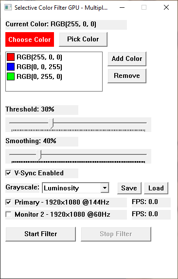
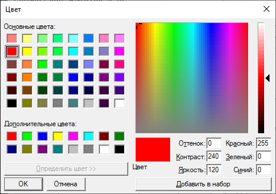
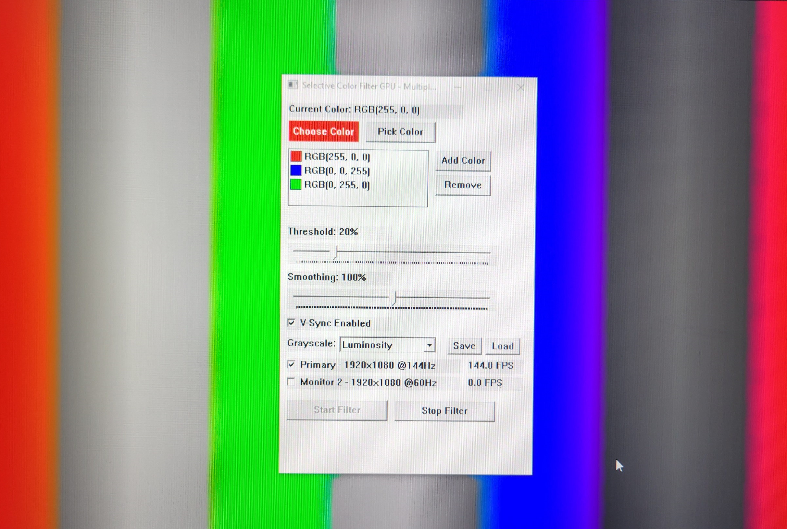

# Selective Color Filter GPU

A high-performance Windows application for real-time selective color filtering with GPU acceleration. Filter out unwanted colors while preserving selected ones across multiple monitors.

## Features

- **GPU-Accelerated Processing** - DirectX 11 compute shaders for maximum performance
- **Multiple Color Selection** - Filter up to 10 colors simultaneously
- **Multi-Monitor Support** - Independent filtering on each monitor with FPS display
- **6 Grayscale Modes** - Average, Luminosity (BT.601), HD (BT.709), Desaturation, Max Channel, Green Only
- **Real-Time Adjustment** - Threshold (1-100%) and Smoothing (0-200%) controls
- **V-Sync Control** - Toggle vertical synchronization for optimal performance
- **Settings Management** - Auto-save/load settings with profile support (.cfg files)
- **Color Picker Tools** - Built-in color picker and eyedropper tool
- **High Refresh Rate Support** - Optimized for 144Hz+ gaming monitors

## Screenshots

### Color Selection

### Filtering in Action

## System Requirements

- Windows 10/11
- DirectX 11 compatible graphics card
- Visual C++ Redistributable 2019 or later

### Tested Configuration
- **OS**: Windows 10
- **Hardware**: Laptop with Intel integrated graphics + NVIDIA discrete GPU
- **Setup**: External monitor connected to discrete GPU
- **Performance**: Stable 144Hz filtering on both integrated and discrete graphics

## Usage

1. **Select Colors**: Use "Choose Color" or "Pick Color" to add colors to filter
2. **Adjust Settings**: Configure threshold and smoothing for fine-tuning
3. **Choose Monitors**: Select which monitors to apply filtering
4. **Start Filter**: Click "Start Filter" to begin real-time processing
5. **Save/Load**: Save different configurations for various use cases

## Controls

- **Threshold**: Color matching sensitivity (1-100%)
- **Smoothing**: Edge softening for smoother transitions (0-200%)
- **Grayscale Mode**: Choose how non-matching colors are converted to grayscale
- **V-Sync**: Enable/disable vertical synchronization
- **ESC**: Stop filtering when overlay is active

## Technical Details

- **Desktop Duplication API** for efficient screen capture
- **DirectX 11 Pixel Shaders** for GPU-only color processing
- **Fullscreen Overlay** rendering with automatic window exclusion
- **Multi-threaded Architecture** for responsive UI during filtering
- **Registry-based Settings** with file export/import support

## Building

1. Open `ColorFilterGPU.sln` in Visual Studio 2019+
2. Build in Release x64 configuration
3. Ensure DirectX SDK and Windows SDK are installed

## License

MIT License - see LICENSE file for details

## Contributing

Pull requests and issues are welcome. Please ensure code follows the existing style and includes appropriate comments.

---

*Developed for high-performance selective color filtering in gaming and professional applications.*